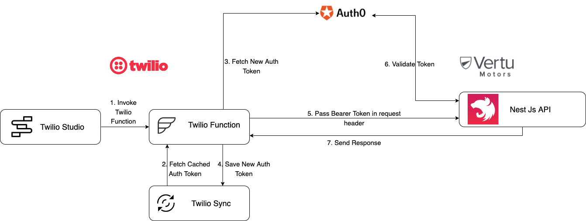
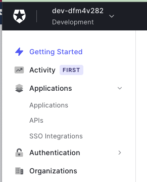
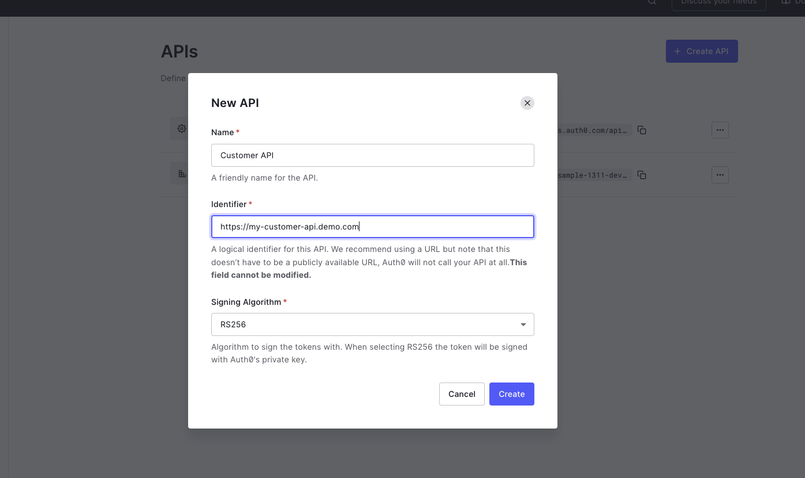
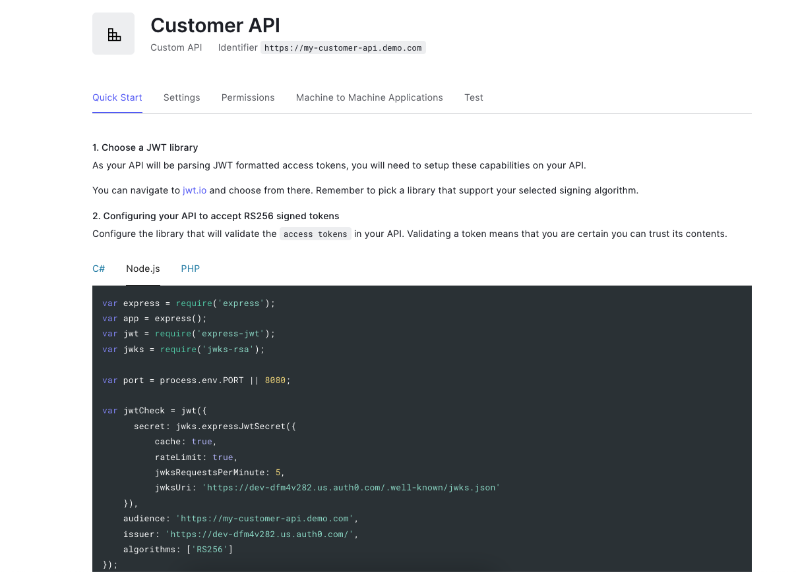
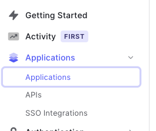
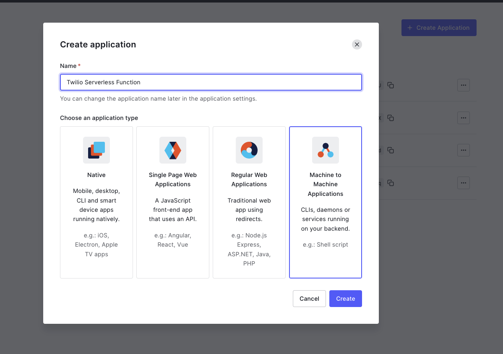
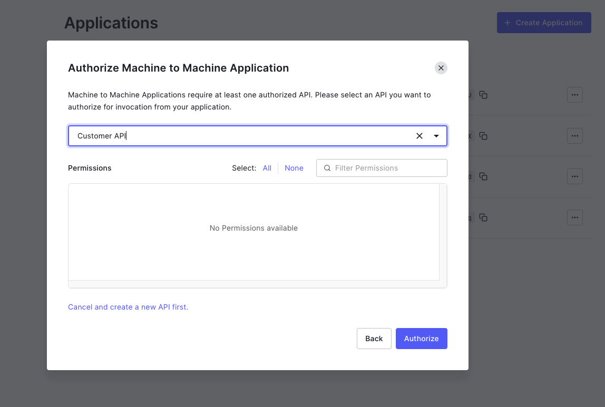
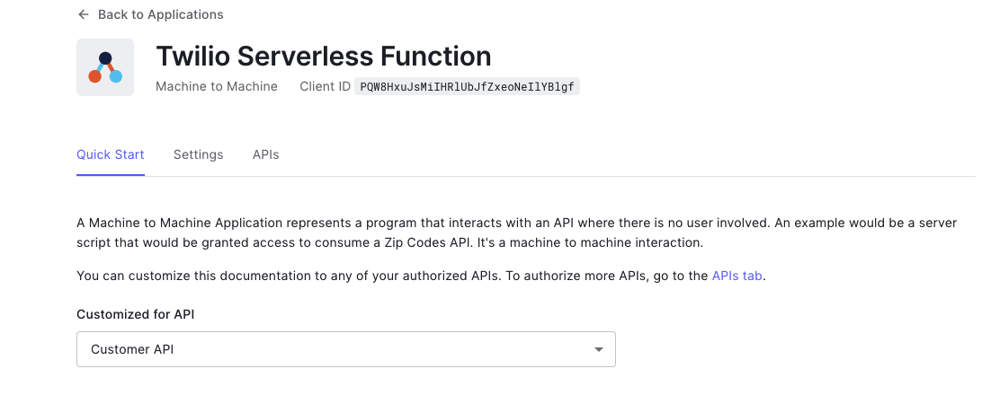
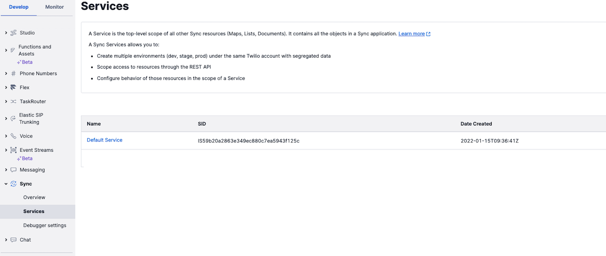

# Overview

* Twilio provides multiple options to integrate with other applications via APIs
* It is important that this communication is secured
* HTTPS can be used for encrypting the communication  
* APIs also need to implement an Authorization mechanism which can be custom built or can leverage services such as Auth0  
* This repo has the sample code for a Twilio Function and a Nest JS API that it invokes leveraging Auth0 authorization

# High Level Solution


1. Twilio Studio Flow invokes a Twilio Function
2. Twilio Function will check if a valid cached access token is present in Twilio Sync  
(If valid token present, skip to step 5)
3. Twilio Function will fetch access token from Auth0
4. Twilio Function will cache the new access token in Twilio Sync
5. Twilio Function will invoke the API by passing the token in Authorization header of HTTP request
6. The API will validate the token with Auth0
7. The API will process the request and send back a response

# Prerequisites

* Auth0 account and access to Auth0 dashboard
* Twilio account and access to Twilio Console

# Auth0 Setup for API (From Auth0 dashboard)

### Step 1. Go to APIs



### Step 2. Create a new API



### Step 3. Explore the new API



### Step 4. Extract the audience and issuer

```
audience: 'https://my-customer-api.demo.com',  
issuer: 'https://dev-dfm4v282.us.auth0.com/'
```


# Auth0 Setup for Consumer ( Twilio Function)

### Step 1. Go to Applications



### Step 2. Create a new Machine to Machine Application



### Step 3. Select API which needs to be authorized from application




### Step 4. Explore the new application



### Step 5. Extract the client id, client secret & audience

```
audience: 'https://my-customer-api.demo.com'  
client_id: '<CLIENT ID>',
client_secret:'<CLIENT SECRET>'
```


# Nest JS API Setup

### Step 1. Configure the environment variables in /secure-api/.env file

```
PORT=7000
AUTH0_ISSUER_URL=https://dev-dfm4v282.us.auth0.com/
AUTH0_AUDIENCE=https://my-customer-api.demo.com
```  

### Step 2. Start Nest JS Application
  
 ```
 npm run start
 ``` 


# Twilio Function Setup

### Step 1. Get Sync Service Sid from Twilio Console




### Step 2. Configure the environment variables in /twilio-auth0-client/.env file

```
TWILIO_SYNC_SERVICE_SID=<Sync Service Sid>
TWILIO_SYNC_TOKEN_DOC=customer-api-token
AUTH0_TOKEN_URL=https://dev-dfm4v282.us.auth0.com/oauth/token
AUTH0_CLIENT_ID=<CLIENT ID>
AUTH0_CLIENT_SECRET=<CLIENT SECRET>
AUTH0_AUDIENCE=https://my-customer-api.demo.com
```  

### Step 3. Start Serverless Function
  
 ```
 npm run start
 ``` 


### Step 4. Test Invocation by opening 'http://localhost:3000/test-api-call' in browser

